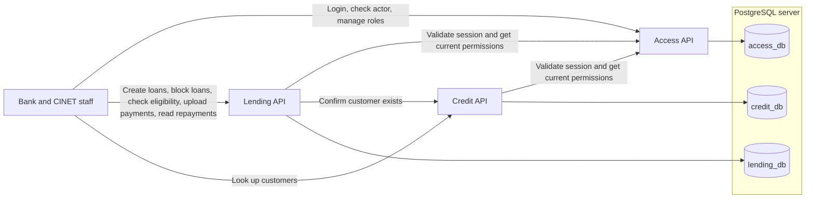

# Architecture and domain language

## What runs today

On protected requests, Lending and Credit ask Access who the current actor is. They then enforce their own permissions and resource scope.

When a bank creates a loan, Lending asks Credit whether the customer exists. Lending then checks the CINET loan block in the same transaction that saves the loan. [ADR 7](adr/0007-keep-loan-eligibility-with-lending.md) explains why Lending owns this status.

## Terms we use

| Term | Meaning in this demo |
| --- | --- |
| Institution | A bank or CINET. Access gives it a stable ID, a code, a display name, and a kind. A staff user belongs to one institution. |
| Customer | A person identified by a Kuwaiti Civil ID. |
| Loan eligibility | Lending's current answer to whether an existing customer can receive a new loan: yes when CINET has not blocked them. |
| Loan block | The customer-wide restriction changed by authorized CINET staff. A blocked customer cannot receive a new loan. |
| Loan | A bank's financing record for a customer. It records the principal, financing rate, tenor, start date, status, and reported repayment schedule. |
| Principal | The amount originally financed, in KWD. It is not the amount still due. |
| Financing rate | The reported interest or profit rate. Lending stores it but does not derive installment amounts from it. |
| Tenor | The length of the loan in months. |
| Repayment schedule / installment | The bank's expected payments: one installment per month for the loan's tenor. Each installment has a due date and a positive KWD amount. |
| Payment | Money the bank reports receiving against one of its loans. A bank's payment reference identifies a report so an identical retry does not create another payment. |
| Delinquent loan | An open loan with an overdue amount greater than zero. An installment becomes overdue the day after its due date. Payments cover the oldest unpaid installments first, including future ones.|
| Next due payment | The oldest unpaid installment across the customer's visible open loans, including an installment already overdue. |
